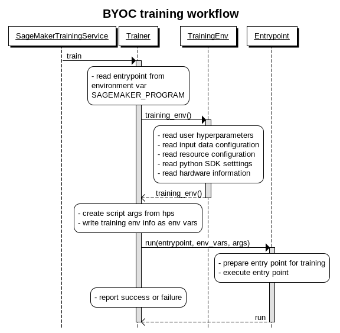

.. _header-n795:

SageMaker Containers Training Workflows
=======================================

.. _header-n797:

Training a BYOC container
-------------------------

In the BYOC scenario, **SAGEMAKER_PROGRAM**, containing the name of the
entrypoint script located under **/opt/ml/code** folder is the only
environment variable required. Alternatively, a hyperparameter named
**sagemaker_program** can be used. The workflow to train a BYOC
container is a follow:

SageMaker invokes the CLI binary
`train <https://github.com/aws/sagemaker-containers/blob/v2.4.4/src/sagemaker_containers/cli/train.py#L17>`__
when training starts. This binary invokes
`trainer.train() <https://github.com/aws/sagemaker-containers/blob/v2.4.4/src/sagemaker_containers/_trainer.py#L41>`__,
the function responsible to create the **training environment**,
**execute the entrypoint** and report results.

**Training environment** creation is encapsulated by
`training_env() <https://github.com/aws/sagemaker-containers/blob/v2.4.4/src/sagemaker_containers/__init__.py#L16>`__
function call, this function returns an
`TrainingEnv <https://github.com/aws/sagemaker-containers/blob/v2.4.4/src/sagemaker_containers/_env.py#L413>`__
object. The **TrainingEnv** provides access to aspects of the training
environment relevant to training jobs, including hyperparameters, system
characteristics, filesystem locations, environment variables and
configuration settings. It is a read-only snapshot of the container
environment during training and it doesn't contain any form of state.
Both framework containers and user scripts can use this class. Example
on how a script can use training environment:

.. code:: python

   import sagemaker_containers

   env = sagemaker_containers.training_env()

   # get the path of the channel 'training' from the inputdataconfig.json file
   training_dir = env.channel_input_dirs['training']

   # get a the hyperparameter 'training_data_file' from hyperparameters.json file
   file_name = env.hyperparameters['training_data_file']

   # get the folder where the model should be saved
   model_dir = env.model_dir
   data = np.load(os.path.join(training_dir, file_name))
   x_train, y_train = data['features'], keras.utils.to_categorical(data['labels'])
   model = ResNet50(weights='imagenet')
   ...
   model.fit(x_train, y_train)

   #save the model in the end of training
   model.save(os.path.join(model_dir, 'saved_model'))

**Entrypoint execution** is encapsulted by `entrypoint.run(entrypoint,
env_vars,
args) <https://github.com/aws/sagemaker-containers/blob/v2.4.4/src/sagemaker_containers/entry_point.py#L22>`__,
it prepares and executes the user entry point, passing **env_vars** as
environment variables and **args** as command arguments. If the entry
point is:

-  **A Python script:** executes the script as
   ``ENV_VARS python entrypoint_name ARGS``

-  **Any other script:** executes the command as
   ``ENV_VARS /bin/sh -c ./module_name ARGS``

Usage example:

.. code:: python

   import sagemaker_containers
   from sagemaker_containers.beta.framework import entry_point, mapping

   env = sagemaker_containers.training_env()
   # {'channel-input-dirs': {'training': '/opt/ml/input/training'}, 'model_dir': '/opt/ml/model', ...}

   # reading hyperparameters as a dictionary
   hyperparameters = env.hyperparameters
   # {'batch-size': 128, 'model_dir': '/opt/ml/model'}

   # reading hyperparameters as script arguments
   args = mapping.to_cmd_args(hyperparameters)
   # ['--batch-size', '128', '--model_dir', '/opt/ml/model']

   # reading the training environment as env vars
   env_vars = env.to_env_vars()
   # {'SAGEMAKER_CHANNELS':'training', 
   #  'SAGEMAKER_CHANNEL_TRAINING':'/opt/ml/input/training',
   #  'MODEL_DIR':'/opt/ml/model', ...}

   # executes user entrypoint named entrypoint.py as follow:
   #
   # SAGEMAKER_CHANNELS=training SAGEMAKER_CHANNEL_TRAINING=/opt/ml/input/training \
   # SAGEMAKER_MODEL_DIR=/opt/ml/model python user_script.py --batch-size 128 --model_dir /opt/ml/model
   entry_point.run('entrypoint.py', args, env_vars)

If the entrypoint execution fails, **trainer.train()** will write the
error message to **/opt/ml/output/failure**.

The entrypoint touches the sucess file under **/opt/ml/success**
otherwise.

.. _header-n814:

Training a Framework container
------------------------------

`TensorFlow <https://github.com/aws/sagemaker-tensorflow-container/tree/script-mode>`__,
`MXNet <https://github.com/aws/sagemaker-mxnet-container>`__,
`PyTorch <https://github.com/aws/sagemaker-pytorch-container>`__,
`Chainer <https://github.com/aws/sagemaker-chainer-container>`__, and
`SciKit <https://github.com/aws/sagemaker-scikit-learn-container>`__ are
**Framework Containers**. The biggest difference between a **Framework
Container** and a **BYOC** is while the latter includes the entry point
under **/opt/ml/code**, the former doesn't include the user entry point
and needs to download it from S3. The workflow is as follow:

.. figure:: https://wsd.aka.amazon.com/cgi-bin/cdraw?lz=dGl0bGUgRnJhbWV3b3JrIENvbnRhaW5lciB0cmFpbmluZyB3b3JrZmxvdwoKCgpvcHRpb24gZm9vdGVyPW5vbmUKClB5dGhvblNESy0-U2FnZU1ha2VyVAA2B1NlcnZpY2U6IEVzdGltYXRvcihlbnRyeXBvaW50LCBrd2FyZ3MqKikuZml0KGNoYW5uZWxzKQoKCgphY3RpdmF0ZSAAVgkKc3RhdGUgb3ZlcgAKCwotIGNyZWF0ZXMgYSBjdXN0b21lciBTMyBidWNrZXQgaWYgbmVjZXNzYXJ5Ci0gY29tcHJlc3MgAH0KIGluIHNvdXJjZS50YXIuZ3oKCmVuZCAAaAYAgVEOMzogdXBsb2FkcwAkDiB0bwByCgBzBgoKAIEaFgCBJAtkZGl0aW9uYWwgaHlwZXJwYXJhbWV0ZXJzCi0gc3RhcnQgdGhlAIJ-CmpvYgoAgQ0OAIJXGC0tPgCDDAk6CgoKZGUAgjsTACQbPgCDOgVlcjoAg38GAIMCCwASBwoKCgoAHQcAJgdpbmdFbnYAKgdpbmdfZW52KCkAKhAAIAYAgg0NAAsNLSByZWFkAIF_ECBwcm92aWRlZCBieQCCPQ0AKAV1c2VyAIIuEwBEBWlucHV0IGRhdGEgY29uZmlndXJhdGlvbgBhCHJlAINzBgAIFnAAhVQFIFNESyBzZXR0dGluZwBRCWhhcmR3YXJlIGluZm9ybQBQBgCELgoAghgIAIIRBi0AgkgKAIMADQCBdx1lcgCFUgkgc2NyaXB0IGFyZ3MgZnJvbSBocHMKLSB3cml0AIQWC2VudgCBCgUgYXMABwV2YXJzAIEHDACDKQlFAIZ6CTogcnVuAIcGDWVudl92YXJzLABpBSkAhn4MAC0KIAoKClMzLQA9DURvd24AhgcUAIErBQCGAB0AgQUKCgotIHByZXBhcmUAhxsGIACHHAZmbwCJBgoKLSBleGVjdXQAFg0Agm8NAII5EjogLSByZXBvcnQgc3VjY2VzcyBvciBmYWlsdXJlCgoKAIIICgCDFBgAgRkMAIMzEWVyCg&s=qsd&h=zyMjvT1cWH7yzUTC
   :alt: 

`Edit this
diagram <https://wsd.aka.amazon.com/?lz=dGl0bGUgRnJhbWV3b3JrIENvbnRhaW5lciB0cmFpbmluZyB3b3JrZmxvdwoKCgpvcHRpb24gZm9vdGVyPW5vbmUKClB5dGhvblNESy0-U2FnZU1ha2VyVAA2B1NlcnZpY2U6IEVzdGltYXRvcihlbnRyeXBvaW50LCBrd2FyZ3MqKikuZml0KGNoYW5uZWxzKQoKCgphY3RpdmF0ZSAAVgkKc3RhdGUgb3ZlcgAKCwotIGNyZWF0ZXMgYSBjdXN0b21lciBTMyBidWNrZXQgaWYgbmVjZXNzYXJ5Ci0gY29tcHJlc3MgAH0KIGluIHNvdXJjZS50YXIuZ3oKCmVuZCAAaAYAgVEOMzogdXBsb2FkcwAkDiB0bwByCgBzBgoKAIEaFgCBJAtkZGl0aW9uYWwgaHlwZXJwYXJhbWV0ZXJzCi0gc3RhcnQgdGhlAIJ-CmpvYgoAgQ0OAIJXGC0tPgCDDAk6CgoKZGUAgjsTACQbPgCDOgVlcjoAg38GAIMCCwASBwoKCgoAHQcAJgdpbmdFbnYAKgdpbmdfZW52KCkAKhAAIAYAgg0NAAsNLSByZWFkAIF_ECBwcm92aWRlZCBieQCCPQ0AKAV1c2VyAIIuEwBEBWlucHV0IGRhdGEgY29uZmlndXJhdGlvbgBhCHJlAINzBgAIFnAAhVQFIFNESyBzZXR0dGluZwBRCWhhcmR3YXJlIGluZm9ybQBQBgCELgoAghgIAIIRBi0AgkgKAIMADQCBdx1lcgCFUgkgc2NyaXB0IGFyZ3MgZnJvbSBocHMKLSB3cml0AIQWC2VudgCBCgUgYXMABwV2YXJzAIEHDACDKQlFAIZ6CTogcnVuAIcGDWVudl92YXJzLABpBSkAhn4MAC0KIAoKClMzLQA9DURvd24AhgcUAIErBQCGAB0AgQUKCgotIHByZXBhcmUAhxsGIACHHAZmbwCJBgoKLSBleGVjdXQAFg0Agm8NAII5EjogLSByZXBvcnQgc3VjY2VzcyBvciBmYWlsdXJlCgoKAIIICgCDFBgAgRkMAIMzEWVyCg&s=qsd&h=zyMjvT1cWH7yzUTC>`__

The subsections below will detail the *integration between SageMaker
Python SDK and SageMaker Containers* and *how to create a framework
container*.

.. _header-n819:

Integration between SageMaker Python SDK and SageMaker Containers
~~~~~~~~~~~~~~~~~~~~~~~~~~~~~~~~~~~~~~~~~~~~~~~~~~~~~~~~~~~~~~~~~

When the SageMaker Python SDK is used to create a training job with a
framework containers, it passes special hyperparameters to the training
job, which are parsed by SageMaker Container and the Framework
Containers. For example:

.. code:: python

   import TensorFlow from SageMaker.tensorflow

   model_dir = 's3://SAGEMAKER-BUCKET/hvd-job-377/model'

   mpi_distribution = {
     'mpi': {
       'enabled': True, 
       'custom_mpi_options': '-x HOROVOD_HIERARCHICAL_ALLREDUCE=1', 
       'processes_per_host': 8}}

   estimator = Tensorflow(entry_point='train_horovod_imagenet.sh',
                          model_dir=model_dir,
                          hyperparameters={'lr': 0.3},
                          distributions=mpi_distribution,
                          ...)

When a training job is created using the estimator above, i.e.
``estimator.fit()`` is called, the Python SDK will create additional
hyperparameters and invoke the training job as follow:

.. code:: python

   import boto3

   job_hyperparameters = {
     # user provided hyperparameters
     'lr': '0.3',

     # hyperparameters created by the Python SDK and used by SageMaker Containers
     'sagemaker_job_name': 'JOB_NAME',
     'sagemaker_program': 'train_horovod_imagenet.sh',
     'sagemaker_region': 'us-west-2',
     'sagemaker_submit_directory': 's3://SAGEMAKER-BUCKET/JOB_NAME/source.tar.gz'
     'sagemaker_container_log_level': '20',
     'sagemaker_mpi_enabled': 'true',
     'sagemaker_mpi_num_of_processes_per_host': '8',

     # hyperparameters created by the Python SDK and used by the TF container
     'model_dir': 's3://SAGEMAKER-BUCKET/hvd-job-377/model'
   }

   boto3.client('sagemaker').create_training_job(HyperParameters=job_hyperparameters, ...)

As you can see in the example, in addition to user provided
hyperparameters, the python SDK includes hyperparameters that will be
used by SageMaker Containers and or the Framework Container. The most
important sagemaker hyperparameters for training are:

-  **sagemaker_program**: name of the user provided entry point, it is
   **mandatory** unless environment variable **SAGEMAKER_PROGRAM** is
   provided.

-  **sagemaker\ submit\ directory**: local or S3 URI location of the
   source.tar.gz file containing the entry point code. It is
   **mandatory** unless the code is already located under the
   **/opt/ml/code** folder.

The complete list of hyperparameters is available
`here <https://github.com/aws/sagemaker-containers/blob/v2.4.4/src/sagemaker_containers/_params.py>`__.

.. _header-n831:

How to create a Framework Container for training
~~~~~~~~~~~~~~~~~~~~~~~~~~~~~~~~~~~~~~~~~~~~~~~~

A framework container is composed by a collection of Docker files and
framework specific logic. Let's see the MXNet container as an example:

.. _header-n833:

Creating the Dockerfile
^^^^^^^^^^^^^^^^^^^^^^^

**Dockerfile**

.. code:: docker

   FROM mxnet/python

   # install SageMaker Containers and SageMaker MXNet Container
   RUN pip install sagemaker-containers sagemaker_mxnet_container

   # set sagemaker_mxnet_container.training.main as framework entrypoint
   ENV SAGEMAKER_TRAINING_MODULE sagemaker_mxnet_container.training:train

In the example above, mxnet and python libraries are already installed
in the base container. The framework container only needs to install
SageMaker Containers and the SageMaker MXNet container package. The
environment variable **SAGEMAKER\ TRAINING\ MODULE** determines that the
function ``train`` under the module ``training`` of the container
package is going to be invoked when the container starts.

**The training package**

.. code:: python

   from sagemaker_containers.beta import framework

   # name of the user entry point from sagemaker hyperparameter
   user_entry_point = env.module_name

   # local or S3 URI location of the source.tar.gz file
   module_dir = env.module_dir

   def train(env):
     env = framework.training_env()
     framework.entrypoint.run(module_dir,
                              user_entry_point,
                              env.to_cmd_args(),
                              env.to_env_vars())

The code above covers everything necessary for single training using
MXNet. The following example includes framework specific logic required
for distributed training.

.. code:: python

   def train(env):
     env = framework.training_env()
     
     ps_port = '8000'

     # starts the MXNet scheduler only in the first instance
     if env.current_host == 'algo-1':
         _run_mxnet_process('scheduler', env.hosts, ps_port)
     
     # starts MXNet parameter server in all instances
     _run_mxnet_process('server', env.hosts, ps_port)

     framework.entrypoint.run(module_dir,
                              user_entry_point,
                              env.to_cmd_args(),
                              env.to_env_vars()) 

The implementation of **run\ mxnet_process** can be found
`here <https://github.com/aws/sagemaker-mxnet-container/blob/64c5c8ed68e34fae50b6ac9521a0a28156fa8cff/src/sagemaker_mxnet_container/training.py#L45>`__.
The example above starts the mxnet **scheduler** in the first instance
and starts the mxnet **server** in all instances.
